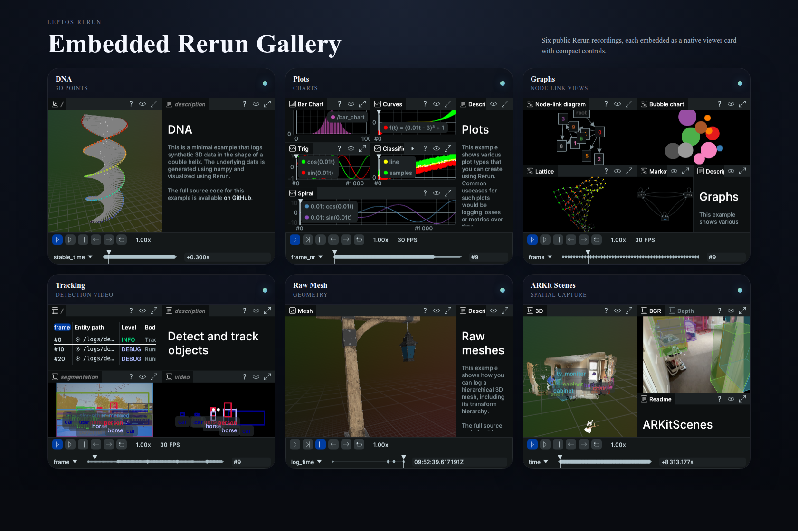

# leptos-rerun

`leptos-rerun` wraps the official Rerun web viewer as a Leptos component.

The API is intentionally flat and close to the Rerun JS viewer: sources and panel overrides live on the root `RerunViewer`, while Leptos-specific pieces stay reactive and ergonomic.

<p align="center">
  
</p>

## Why This Crate

- Flat root props that feel familiar if you already use the Rerun JS viewer
- Reactive Leptos inputs for sources, panel overrides, and startup options
- Official `@rerun-io/web-viewer` loaded from a pinned CDN build by default
- Works with `csr`, `hydrate`, and `ssr` Leptos setups
- Native Rerun viewer chrome, not custom control overlays

## Install

This workspace is not published yet, so use a path dependency for now.

Choose the feature that matches your app:

```toml
[dependencies]
leptos = { version = "0.8", default-features = false, features = ["csr"] }
leptos-rerun = { path = "../leptos-rerun/leptos-rerun", default-features = false, features = ["csr"] }
```

Available crate features:

- `csr`
- `hydrate`
- `ssr`

## Quick Start

```rust
use leptos::prelude::*;
use leptos_rerun::prelude::*;

#[component]
fn App() -> impl IntoView {
    view! {
        <RerunViewer
            style="width: 100%; height: 100vh;".to_string()
            rrd="https://app.rerun.io/version/0.31.2/examples/dna.rrd"
            panel_state_overrides=[(Panel::Blueprint, PanelState::Collapsed)]
            hide_welcome_screen=true
            theme=Theme::Dark
        />
    }
}
```

## Gallery Embed

[`gallery-viewer`](examples/gallery-viewer/src/main.rs) now demonstrates a 3x2 grid of embedded Rerun cards. Each card uses native Rerun controls with the dense timeline removed, which makes it a better test of whether the component works as a real gallery surface instead of a single fullscreen-style embed.

```rust
use leptos::prelude::*;
use leptos_rerun::prelude::*;

#[component]
fn GalleryGrid() -> impl IntoView {
    view! {
        <section
            style="display: grid; grid-template-columns: repeat(auto-fit, minmax(380px, 1fr)); gap: 20px;"
        >
            <RerunViewer
                style="width: 100%; min-height: 286px;".to_string()
                rrd="https://app.rerun.io/version/0.31.2/examples/dna.rrd"
                panel_state_overrides=[
                    (Panel::Top, PanelState::Hidden),
                    (Panel::Blueprint, PanelState::Hidden),
                    (Panel::Selection, PanelState::Hidden),
                    (Panel::Time, PanelState::Collapsed),
                ]
                hide_welcome_screen=true
                theme=Theme::Dark
            />
        </section>
    }
}
```

## `RerunViewer` Props

The main public surface lives on `RerunViewer`.

- `rrd`: one or more `.rrd` or `rerun+http://.../proxy` URLs
- `panel_state_overrides`: `Panel -> PanelState` overrides
- `asset_origin`: where to load the viewer module from
- `theme`
- `render_backend`
- `video_decoder`
- `hide_welcome_screen`
- `manifest_url`
- `allow_fullscreen`
- `follow_if_http`
- `class`, `style`, `node_ref`
- `on_event`

Useful enums and value types are re-exported from the prelude:

- `AssetOrigin`
- `Theme`
- `RenderBackend`
- `VideoDecoder`
- `Panel`
- `PanelState`
- `Rrds`
- `PanelStateOverrides`
- `RerunViewerEvent`

`rrd` accepts plain values or reactive Leptos inputs:

- `&str`
- `String`
- `Vec<String>`
- arrays like `["a.rrd", "b.rrd"]`
- `Signal`, `ReadSignal`, `RwSignal`, and `Memo`

`panel_state_overrides` accepts:

- arrays like `[(Panel::Top, PanelState::Hidden)]`
- `Vec<(Panel, PanelState)>`
- `BTreeMap<Panel, PanelState>`
- `Signal`, `ReadSignal`, `RwSignal`, and `Memo`

## Imperative Control

`RerunViewerContext` exposes imperative methods for cases where a declarative prop is not the right fit:

- `open(url, follow_if_http)`
- `close(url)`
- `set_active_recording_id(recording_id)`
- `set_playing(recording_id, value)`
- `set_current_time(recording_id, timeline, time)`
- `set_active_timeline(recording_id, timeline)`
- `ready`, `ready_signal`
- `last_event`, `last_event_signal`
- `last_error`, `last_error_signal`

`follow_if_http` applies the documented Rerun `viewer.open(url, { follow_if_http: true })`
behavior to declarative `rrd` URLs. This is useful for HTTP-backed sources such as remote
`.mcap` files.

## Examples

From the workspace root:

```bash
cargo check --workspace
cargo test -p leptos-rerun
```

Client-side examples:

```bash
cd examples/simple-viewer
trunk serve --open
```

```bash
cd examples/gallery-viewer
trunk serve --open
```

```bash
cd examples/mcap-viewer
trunk serve --open
```

SSR + hydration example:

```bash
cd examples/with-server
cargo leptos watch
```

## Notes

- The default viewer asset origin is pinned to `@rerun-io/web-viewer@0.31.2` on jsDelivr.
- If an environment has trouble creating the default surface, try `render_backend=RenderBackend::Webgl`.
